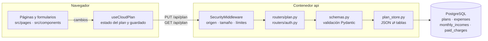

# Clara · Finanzas personales

Planificador de gastos en español con cuentas de usuario. Incluye registro, inicio de sesión, recuperación con código privado y sesiones revocables. El plan financiero de cada usuario se guarda en PostgreSQL y se sincroniza entre dispositivos.

| Capa | Tecnología |
| --- | --- |
| Frontend | React 19 + Vite, Recharts |
| API | Python 3.13, FastAPI, SQLAlchemy 2, Alembic, Argon2id |
| Base de datos | PostgreSQL 17 |
| Despliegue | Docker Compose (local) · Render (imagen Docker + Postgres gestionado) |

## Arquitectura



- Un único contenedor (`api`) sirve la web compilada y la API `/api` desde el mismo origen. Así las cookies de sesión `SameSite=Strict` funcionan sin CORS.
- El navegador **no guarda datos financieros**: solo tiene en memoria el plan de la sesión abierta. La sesión viaja en una cookie `HttpOnly` que JavaScript no puede leer.
- Toda la configuración financiera vive en PostgreSQL, en tablas con tipos y restricciones (ver [Guardado de la configuración](#guardado-de-la-configuración)).

## Estructura del proyecto

```
├── src/                          FRONTEND (React)
│   ├── main.jsx                  Punto de entrada: monta AppRoot y carga los estilos
│   ├── app/
│   │   ├── AppRoot.jsx           Controla la sesión: pantalla de carga, acceso o panel
│   │   └── Dashboard.jsx         Panel del usuario: estado del plan, navegación y diálogos
│   ├── pages/                    Una página por sección del menú (cargadas bajo demanda)
│   │   ├── OverviewPage.jsx      Vista general: disponible, métricas, gráficos, próximos cobros
│   │   ├── ExpensesPage.jsx      Listado de gastos con búsqueda y filtro
│   │   ├── CalendarPage.jsx      Calendario del mes y marcado de cobros pagados
│   │   ├── ForecastPage.jsx      Previsión a 12 meses, simulador y tabla
│   │   └── ReservesPage.jsx      Reservas para pagos trimestrales y anuales
│   ├── components/
│   │   ├── layout/               Sidebar (menú hamburguesa en móvil), Topbar, PageHeading, MainFooter, avisos
│   │   ├── settings/             PlanSettingsForm (base del plan) e IncomeFields (ingreso fijo/variable)
│   │   ├── expenses/             Tabla, formulario e icono de gastos
│   │   ├── charts/               Gráfico de previsión, donut por categorías y tooltip
│   │   └── ui/                   Modal, Toast, MonthPicker, LoadingScreen, PageSkeleton
│   ├── modals/                   Diálogos: cálculo del disponible, avisos, confirmaciones
│   ├── features/auth/            Acceso, registro, código de recuperación y panel de cuenta/sesiones
│   ├── hooks/
│   │   ├── useCloudPlan.js       Sincroniza el plan con la API (guardado, reintentos, conflictos)
│   │   ├── usePlanView.js        Datos derivados del mes seleccionado (previsión, avisos…)
│   │   └── useToast.js           Mensajes temporales
│   ├── lib/
│   │   ├── api.js                Cliente HTTP: cookies, token CSRF y errores
│   │   ├── finance.js            Cálculos de la previsión y validación de copias
│   │   ├── backup.js             Exportar/importar copias JSON y plan vacío
│   │   └── motion.js             Utilidades de animación (respeta «reducir movimiento»)
│   ├── config/navigation.js      Secciones del menú y textos de cada página
│   └── styles/                   global · auth · navigation · income · loading
│
├── backend/                      API (FastAPI)
│   ├── app/
│   │   ├── main.py               Crea la app: middleware, rutas, estáticos, limpieza periódica
│   │   ├── config.py             Configuración desde variables de entorno (.env)
│   │   ├── middleware.py         Cabeceras de seguridad, origen, tamaño y límite de peticiones
│   │   ├── routers/
│   │   │   ├── auth.py           /api/auth/*: registro, login, recuperación, sesiones, contraseña
│   │   │   └── plan.py           /api/plan: leer y guardar la configuración financiera
│   │   ├── schemas.py            Validación estricta (Pydantic) del plan y de las credenciales
│   │   ├── plan_store.py         Conversión entre el plan JSON del frontend y las tablas
│   │   ├── models.py             Modelos SQLAlchemy (tablas y restricciones)
│   │   ├── sessions.py           Emisión, validación y caducidad de sesiones
│   │   ├── security.py           Argon2id, tokens y CSRF
│   │   ├── rate_limit.py         Límites de intentos persistentes en PostgreSQL
│   │   └── errors.py             Respuestas de error uniformes, sin detalles internos
│   ├── migrations/versions/
│   │   ├── 0001_initial.py       Usuarios, sesiones, límites y plan (formato JSON inicial)
│   │   └── 0002_normalized_plan.py  Plan en tablas tipadas + ingreso variable (migra datos)
│   ├── tests/                    pytest contra PostgreSQL real
│   └── requirements*.txt
│
├── tests/                        Cálculos (node:test) y prueba E2E con Playwright
├── Dockerfile                    Multi-stage: compila el frontend → imagen de la API que lo sirve
├── docker-compose.yml            Servicios db y api (+ perfil test)
├── render.yaml                   Despliegue en Render
└── .env.example                  Plantilla de configuración (copiar a .env)
```

## Guardado de la configuración

### Qué se guarda y dónde

Todo lo que el usuario configura se guarda en PostgreSQL, en tablas asociadas a su cuenta:

| Tabla | Contenido | Clave |
| --- | --- | --- |
| `plans` | Base del plan: mes de inicio, tipo de ingreso, ingreso (fijo o estimado), presupuesto diario, colchón y revisión | `user_id` |
| `expenses` | Cada gasto: nombre, importe, categoría, frecuencia, día, primer y último mes, reserva inicial y orden | `user_id` + `id` |
| `monthly_incomes` | Ingreso de cada mes cuando el ingreso es variable | `user_id` + `month` |
| `paid_charges` | Cobros marcados como pagados en el calendario | `user_id` + `month` + `expense_id` |
| `users`, `sessions`, `rate_limits` | Cuentas, sesiones (solo el hash del token) y límites de intentos | — |

Todas las tablas del plan dependen de `plans.user_id`, que a su vez depende de `users.id`, con borrado en cascada: al eliminar un usuario desaparecen todos sus datos.

La base de datos valida por sí misma cada fila, aunque falle la validación de la API:

- Los importes son `NUMERIC(11,2)`, con dos decimales exactos y entre 0 y 100.000.000. El importe de un gasto debe ser mayor que 0.
- Los meses tienen formato `AAAA-MM`, y el último mes de un gasto no puede ser anterior al primero.
- Categoría, frecuencia y tipo de ingreso solo admiten los valores válidos, y el día de cobro va de 1 a 31.

### Cómo viaja un cambio

1. **Formulario.** El usuario edita algo, por ejemplo en Configuración (`PlanSettingsForm` + `IncomeFields`), en un gasto (`ExpenseForm`) o al marcar un cobro. `Dashboard` actualiza el plan en memoria y la interfaz se recalcula al momento.
2. **Agrupación.** `useCloudPlan` espera **800 ms** sin cambios y envía el plan completo con la revisión que conoce:
   ```http
   PUT /api/plan
   { "revision": 7, "data": { ...plan... } }
   ```
   Solo hay una escritura en curso por pestaña. Los fallos temporales se reintentan con espera creciente (hasta 30 s). La cabecera muestra el estado: *Guardando cambios…*, *Sincronizado con tu cuenta*, *Sin sincronizar*…
3. **Protección.** `SecurityMiddleware` rechaza la petición si no llega en JSON, desde un origen permitido y con la cabecera propia de Clara, o si supera 1 MiB. Después, `sessions.py` comprueba la cookie de sesión y el token CSRF.
4. **Validación.** `schemas.py` (`SavePlanIn` / `PlanDocument`) rechaza campos desconocidos, tipos incorrectos (`"100"`, `true`), importes con más de dos decimales, meses no válidos o identificadores de gasto repetidos. El usuario siempre sale de la sesión; nunca se acepta del cuerpo de la petición.
5. **Escritura.** `plan_store.save_plan` hace todo en **una transacción**:
   - `UPDATE plans … WHERE user_id = ? AND revision = ?`, que incrementa la revisión.
   - Si ninguna fila coincide, otro dispositivo guardó antes: la API responde **409** y no se sobrescribe nada.
   - Si coincide, sustituye las filas de `expenses`, `monthly_incomes` y `paid_charges` del usuario.
6. **Respuesta.** La API devuelve `{ revision, updatedAt }` y el cliente guarda la nueva revisión.

**Lectura.** Al iniciar sesión, `GET /api/plan` usa `plan_store.load_plan` para reconstruir el plan desde las tablas y lo devuelve junto con su revisión. Mientras la página está visible, `GET /api/plan/revision` comprueba como mucho una vez por minuto si otro dispositivo cambió el plan. Solo entonces se vuelve a descargar.

**Conflictos.** Ante un 409, Clara bloquea el guardado y ofrece dos opciones: descargar los cambios locales en JSON o cargar la versión guardada. Si la sesión caduca, los cambios pendientes se conservan en la página hasta volver a iniciar sesión.

### Correspondencia entre el plan JSON y las tablas

El frontend trabaja con un único objeto (el mismo formato que las copias de seguridad). `plan_store.py` lo traduce:

| Campo del plan (frontend) | Columna en la base de datos |
| --- | --- |
| `startMonth` | `plans.start_month` |
| `incomeMode` (`fixed` / `variable`) | `plans.income_mode` |
| `income` | `plans.income` (ingreso fijo, o estimado por defecto si es variable) |
| `incomes` → `{ "2026-10": 720.5 }` | `monthly_incomes (month, amount)`: solo los meses con importe |
| `variable` | `plans.variable_budget` |
| `cushion` | `plans.cushion` |
| `demo` | `plans.demo` |
| `expenses[]` | `expenses`, una fila por gasto (`position` conserva el orden; `start`/`end` → `start_month`/`end_month`) |
| `paid` → `{ "2026-10:rent": true }` | `paid_charges (month, expense_id, paid)` |
| revisión (fuera de `data`) | `plans.revision` |

Al registrarse, `create_empty_plan` crea la fila de `plans` con valores a cero y el mes actual como inicio.

### Ingreso fijo o variable

En Configuración se elige el tipo de ingreso:

- **Ingreso fijo** (nómina, pensión): se usa `income` todos los meses.
- **Ingreso variable** (paro, trabajo por horas, autónomos): se indica el importe de cada mes, hasta 24 meses. `income` actúa como **ingreso estimado** para los meses que se dejen en blanco.

`finance.js` (`incomeFor`) elige el ingreso de cada mes. La previsión, el disponible, los gráficos y los avisos lo usan. En la tabla de previsión, los meses estimados se marcan con «~».

### Cambios en el esquema (migraciones)

Las tablas se crean y modifican con Alembic (`backend/migrations/versions/`). El contenedor `api` ejecuta `alembic upgrade head` antes de arrancar, así que al actualizar basta con reconstruir:

```sh
docker compose up -d --build
```

La migración `0002` convirtió los planes que estaban guardados como JSON en las tablas actuales sin perder datos. Para revertirla: `alembic downgrade 0001`. Al revertir se pierden los ingresos por mes.

**Añadir un campo nuevo a la configuración** (por ejemplo, un objetivo de ahorro):

1. `backend/app/models.py`: nueva columna con su restricción `CHECK`.
2. Nueva migración: `alembic revision -m "objetivo de ahorro"`, editada a mano con `op.add_column(...)` y un valor por defecto para las filas existentes.
3. `backend/app/schemas.py`: el campo en `PlanDocument`, con valor por defecto para admitir copias antiguas.
4. `backend/app/plan_store.py`: leerlo en `load_plan` y escribirlo en `save_plan`.
5. `src/lib/finance.js` (`validateData`, `demoData`) y `src/lib/backup.js` (`emptyPlan`).
6. El formulario en `src/components/settings/`.
7. Pruebas en `backend/tests/` y `tests/finance.test.js`.

## Puesta en marcha con Docker

Requiere Docker Desktop.

```sh
cp .env.example .env        # y sustituye POSTGRES_PASSWORD y SECRET_KEY
docker compose up -d --build
```

Abre http://localhost:8000. El contenedor `api` aplica las migraciones y sirve la web y la API. PostgreSQL solo escucha en `127.0.0.1:5432` y los datos persisten en el volumen `clara_pgdata`. La interfaz se adapta a móvil y tablet: por debajo de 1020 px la barra lateral pasa a un menú hamburguesa.

```sh
docker compose logs -f api     # registros
docker compose down            # parar (conserva los datos)
docker compose down -v         # parar y BORRAR la base de datos
```

Copia de la base de datos local:

```sh
docker compose exec db pg_dump -U clara -Fc clara > clara.dump
```

## Desarrollo con recarga en caliente

1. Base de datos: `docker compose up -d db`
2. API (desde `backend/`, con Python 3.12+):

   ```sh
   python -m venv .venv && .venv\Scripts\activate   # Windows (en Linux/macOS: source .venv/bin/activate)
   pip install -r requirements-dev.txt
   alembic upgrade head
   uvicorn app.main:create_app --factory --reload --port 8000
   ```

   La API lee el `.env` de la raíz. La documentación interactiva está en http://127.0.0.1:8000/api/docs (desactivada en producción).
3. Frontend: `npm install && npm run dev` y abre http://127.0.0.1:5173. Vite reenvía `/api` al puerto 8000.

También puedes usar el contenedor `api` como backend mientras desarrollas el frontend con Vite: los orígenes `:5173` y `:8000` están permitidos en `APP_ORIGIN`.

## Variables de entorno

Todas están documentadas en [.env.example](.env.example). Las más importantes:

| Variable | Descripción |
| --- | --- |
| `ENVIRONMENT` | `development`, `test` o `production`. Producción exige HTTPS y usa la cookie `__Host-clara_session` |
| `POSTGRES_*` | Credenciales del contenedor de PostgreSQL |
| `DATABASE_URL` | Conexión usada fuera de Docker; en Compose se genera apuntando al servicio `db` |
| `SECRET_KEY` | Firma de los tokens CSRF. Mínimo 32 caracteres, distinto en cada entorno |
| `APP_ORIGIN` | Orígenes permitidos para escrituras, separados por comas |
| `FORWARDED_ALLOW_IPS` | Proxies de confianza para `X-Forwarded-*` (`*` tras el balanceador de Render) |

`.env` está excluido de Git. Genera secretos con `python -c "import secrets; print(secrets.token_urlsafe(48))"`.

## Comprobaciones

```sh
npm test                                               # cálculos financieros
docker compose --profile test run --rm --build tests   # API contra PostgreSQL (crea la BD clara_test)
npm run build
```

Las pruebas de la API cubren el guardado y la lectura del plan, el ingreso variable, las restricciones de la base de datos, la migración de planes antiguos, los conflictos de revisión, el aislamiento entre usuarios y la seguridad de sesiones.

Prueba E2E con el stack levantado (`docker compose up -d`):

```sh
CLARA_BASE_URL=http://127.0.0.1:8000 npm run test:browser
```

Necesita un Chromium de Playwright (`npx playwright install chromium`) o uno existente mediante `PLAYWRIGHT_CHROMIUM_EXECUTABLE`, por ejemplo Microsoft Edge. La prueba crea cuentas: ejecútala solo en entornos de desarrollo.

## Cuentas y uso

Al registrarte se muestra una sola vez un código de recuperación: guárdalo en un lugar privado. El correo es el identificador de acceso; esta versión no envía emails ni verifica su titularidad. Cada cuenta empieza con un plan vacío.

Desde Configuración puedes descargar una copia JSON del plan o restaurarla. Si en el navegador queda un plan de la versión anterior (sin cuentas), aparece un aviso para importarlo a tu cuenta.

## Cálculos

Disponible = ingreso del mes − gastos directos − aportaciones a reservas − déficit de reservas al vencimiento − presupuesto diario − colchón mensual.

Las reservas se acumulan desde el inicio del plan y cubren los vencimientos sin descontarlos dos veces. La aplicación no tiene conexión bancaria.

## Despliegue en Render

[render.yaml](render.yaml) define un **Web Service** con la imagen Docker y una base **PostgreSQL gestionada** en Frankfurt. `SECRET_KEY` se genera automáticamente y `DATABASE_URL` se enlaza con la base. Al crear el Blueprint, introduce `APP_ORIGIN` con la URL HTTPS exacta del servicio. Las migraciones se aplican en cada arranque.

Como la API no guarda estado en disco, puede escalar a varias instancias. Los límites de inicio de sesión se comparten a través de la base de datos. Más detalles en [SECURITY.md](SECURITY.md).
